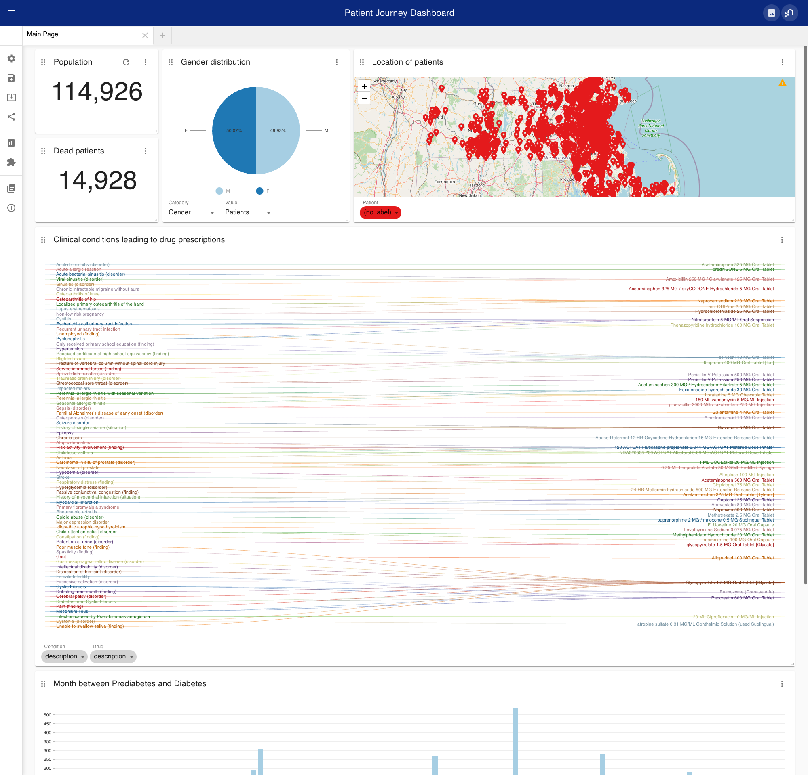
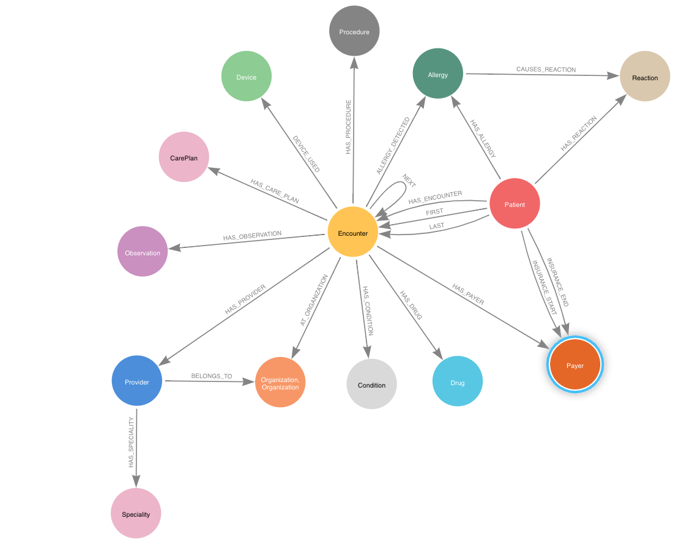

# Patient Journey on Synthetic Patient Data
With this repository I want to provide a solution for 
- storing highly heterogenous patient data
- queries 
- visualization solutions like NeoDash or Neo4j Bloom
- Graph Data Science (GDS)

# Source Data
SyntheaTM is a Synthetic Patient Population Simulator. The goal is to output synthetic, realistic (but not real), patient data and associated health records in a variety of formats.

For more information please read [wiki](https://github.com/synthetichealth/synthea/wiki).

## Files (csv format)
Synthea provides data in `JSON` as well as in `CSV`format. Currently, I intergrated the following entites into Neo4j:
- Patients
- Encounters
- Conditions
- Observations
- Allergy
- Reaction
- Drug
- Procedure
- Device
- Care Plan
- Providers
- Speciality
- Organizations
- Payers
## Data Model

## Loading Data

# Visualization
## NeoDash

## Bloom
